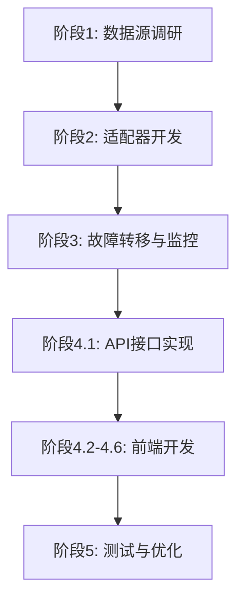

# 多数据源适配器扩展 - 开发计划

**版本**: v1.0
**创建时间**: 2025-11-20
**计划周期**: 2-3周
**关联文档**:
- 详细设计: `doc/design/multi_datasource_adapter_design.md`
- Backlog: `doc/backlog/多数据源适配器扩展.md`

---

## 目录

1. [项目概览](#1-项目概览)
2. [里程碑规划](#2-里程碑规划)
3. [阶段1: 数据源调研与评估](#3-阶段1-数据源调研与评估)
4. [阶段2: 适配器开发](#4-阶段2-适配器开发)
5. [阶段3: 故障转移与监控](#5-阶段3-故障转移与监控)
6. [阶段4: 前端开发](#6-阶段4-前端开发)
7. [阶段5: 测试与优化](#7-阶段5-测试与优化)
8. [资源分配](#8-资源分配)
9. [风险管理](#9-风险管理)
10. [验收标准](#10-验收标准)

---

## 1. 项目概览

### 1.1 项目目标

实现多数据源适配器扩展,从当前2个数据源扩展到5-7个,并实现自动故障转移、健康监控和配置管理功能。

### 1.2 时间计划

**总工期**: 2-3周 (10-15个工作日)
**开始日期**: TBD
**目标完成日期**: TBD

### 1.3 团队规模

**开发人员**: 1名全职开发者
**评审人员**: 1名技术负责人 (部分时间)

### 1.4 交付物

**代码交付:**
- [ ] 3-5个新数据源适配器
- [ ] 故障转移服务
- [ ] 健康监控服务
- [ ] 配置管理服务
- [ ] 前端数据源管理页面
- [ ] API接口实现

**文档交付:**
- [ ] API文档更新
- [ ] 用户使用手册
- [ ] 运维手册
- [ ] 测试报告

**测试交付:**
- [ ] 单元测试 (覆盖率 > 80%)
- [ ] 集成测试
- [ ] 性能测试报告
- [ ] 故障模拟测试报告

---

## 2. 里程碑规划

### M1: 数据源评估完成 (Day 3)

**目标:**
- 完成所有候选数据源的注册和测试
- 确定最终实施的3-5个数据源
- 输出数据源评估报告

**验收标准:**
- [ ] 至少测试5个候选数据源
- [ ] 记录每个数据源的调用限制、响应时间、稳定性
- [ ] 确定优先级清单

### M2: 适配器开发完成 (Day 8)

**目标:**
- 完成所有新适配器的开发
- 单元测试覆盖率 > 80%
- 数据标准化验证通过

**验收标准:**
- [ ] 至少3个新适配器可正常工作
- [ ] 所有适配器返回标准化数据格式
- [ ] 单元测试全部通过

### M3: 核心功能完成 (Day 12)

**目标:**
- 故障转移机制正常工作
- 健康监控系统上线
- 配置管理功能可用

**验收标准:**
- [ ] 故障转移测试通过
- [ ] 健康检查接口可用
- [ ] 配置可动态更新

### M4: 前端完成 (Day 15)

**目标:**
- 数据源管理页面上线
- 回测页面显示数据源信息
- 端到端测试通过

**验收标准:**
- [ ] 可查看数据源状态
- [ ] 可配置优先级
- [ ] 可启用/禁用数据源

### M5: 项目交付 (Day 18)

**目标:**
- 所有测试通过
- 文档完善
- 代码审查通过

**验收标准:**
- [ ] 性能测试达标
- [ ] 文档齐全
- [ ] 代码合并到主分支

---

## 3. 阶段1: 数据源调研与评估

### 3.1 时间安排

**工期**: 3天 (Day 1-3)
**负责人**: 后端开发

### 3.2 任务清单

#### Task 1.1: 注册候选数据源 (0.5天)

**描述**: 注册所有候选数据源账号,获取API密钥

**子任务:**
- [ ] 注册 Baostock 账号
- [ ] 注册 Tushare 账号 (获取积分)
- [ ] 注册 AllTick 账号 (获取API key)
- [ ] 注册 Infoway 账号 (如需要)
- [ ] 注册 NowAPI 账号 (如需要)
- [ ] 整理所有API密钥到安全位置

**输出:**
- 账号清单和凭证

#### Task 1.2: 测试数据源API (1天)

**描述**: 编写测试脚本,验证每个数据源的可用性

**子任务:**
- [ ] 编写 Baostock 测试脚本
  - 测试获取股票数据 (000001, 2023-01-01 ~ 2023-12-31)
  - 测试搜索功能
  - 记录响应时间
- [ ] 编写 Tushare 测试脚本
  - 测试积分限制
  - 测试数据格式
  - 记录响应时间
- [ ] 编写 AllTick 测试脚本
  - 测试免费版限制
  - 测试港股数据
  - 记录响应时间
- [ ] 编写其他数据源测试脚本
- [ ] 汇总测试结果

**输出:**
- 测试脚本 (`backend/debug_scripts/test_datasources.py`)
- 测试结果报告

#### Task 1.3: 数据源评估和选型 (1天)

**描述**: 分析测试结果,确定最终实施的数据源

**评估维度:**
- 稳定性 (成功率)
- 响应速度 (平均响应时间)
- 免费额度 (调用限制)
- 数据质量 (准确性、完整性)
- 市场覆盖 (A股/港股/美股)
- 文档质量 (易用性)

**子任务:**
- [ ] 填写评估矩阵
- [ ] 确定优先级分组
  - 第一批实施: 高优先级 (3个)
  - 第二批实施: 中优先级 (1-2个)
  - 备选: 低优先级
- [ ] 输出数据源选型文档

**输出:**
- 数据源评估报告 (`doc/design/datasource_evaluation_report.md`)
- 最终数据源清单

#### Task 1.4: API文档整理 (0.5天)

**描述**: 整理每个选定数据源的API文档

**子任务:**
- [ ] 记录API端点
- [ ] 记录请求参数格式
- [ ] 记录响应数据格式
- [ ] 记录异常处理方式
- [ ] 记录限流规则

**输出:**
- API参考文档 (`doc/design/datasource_api_reference.md`)

### 3.3 验收标准

- [ ] 至少测试5个候选数据源
- [ ] 确定3-5个可实施的数据源
- [ ] 评估报告完成
- [ ] API文档齐全

---

## 4. 阶段2: 适配器开发

### 4.1 时间安排

**工期**: 5天 (Day 4-8)
**负责人**: 后端开发

### 4.2 任务清单

#### Task 2.1: 增强BaseDataAdapter (0.5天)

**描述**: 增强基类,支持新功能

**子任务:**
- [ ] 添加新属性
  - `name`, `display_name`
  - `supported_markets`
  - `is_enabled`, `requires_auth`
  - `timeout`
- [ ] 添加新方法
  - `health_check()`
  - `validate_config()`
  - `get_metadata()`
- [ ] 更新文档字符串
- [ ] 编写单元测试

**文件:**
- `backend/app/adapters/base.py`

#### Task 2.2: 实现适配器注册机制 (0.5天)

**描述**: 实现装饰器模式的适配器自动注册

**子任务:**
- [ ] 实现 `@register_adapter` 装饰器
- [ ] 修改 `AdapterFactory` 支持注册表
- [ ] 实现自动扫描和加载
- [ ] 编写单元测试

**文件:**
- `backend/app/adapters/factory.py`
- `backend/app/adapters/registry.py` (新建)

#### Task 2.3: 实现Baostock适配器 (1天)

**描述**: 开发Baostock数据源适配器

**子任务:**
- [ ] 安装 baostock 库
- [ ] 实现 `BaostockAdapter` 类
  - `get_stock_data()` - 获取历史数据
  - `search_stock()` - 搜索股票
  - `get_stock_info()` - 获取股票信息
  - `health_check()` - 健康检查
- [ ] 数据标准化处理
  - 列名映射
  - 日期格式转换
  - 缺失值处理
- [ ] 异常处理
  - 网络异常
  - 数据格式异常
  - 超时处理
- [ ] 编写单元测试
  - 正常流程测试
  - 异常流程测试
  - 数据格式验证

**文件:**
- `backend/app/adapters/baostock_adapter.py` (新建)
- `backend/tests/adapters/test_baostock_adapter.py` (新建)

#### Task 2.4: 实现Tushare适配器 (1天)

**描述**: 开发Tushare数据源适配器

**子任务:**
- [ ] 安装 tushare 库
- [ ] 实现 `TushareAdapter` 类
  - 处理积分认证
  - 实现核心方法
- [ ] 数据标准化处理
- [ ] 异常处理
  - 积分不足
  - 限流处理
- [ ] 编写单元测试

**文件:**
- `backend/app/adapters/tushare_adapter.py` (新建)
- `backend/tests/adapters/test_tushare_adapter.py` (新建)

#### Task 2.5: 实现AllTick适配器 (1天)

**描述**: 开发AllTick数据源适配器

**子任务:**
- [ ] 研究 AllTick API
- [ ] 实现 `AllTickAdapter` 类
  - API密钥认证
  - 实现核心方法
  - 支持港股数据
- [ ] 数据标准化处理
- [ ] 异常处理
  - 认证失败
  - 限流处理
- [ ] 编写单元测试

**文件:**
- `backend/app/adapters/alltick_adapter.py` (新建)
- `backend/tests/adapters/test_alltick_adapter.py` (新建)

#### Task 2.6: 其他适配器 (可选,1天)

**描述**: 根据评估结果,开发其他优先级适配器

**候选:**
- Infoway适配器
- NowAPI适配器
- 其他

#### Task 2.7: 异常类定义 (0.5天)

**描述**: 定义统一的异常类型体系

**子任务:**
- [ ] 定义异常基类 `DataAdapterException`
- [ ] 定义子异常类
  - `NetworkException`
  - `AuthenticationException`
  - `RateLimitException`
  - `DataNotFoundException`
  - `DataFormatException`
  - `TimeoutException`
- [ ] 编写文档

**文件:**
- `backend/app/adapters/exceptions.py` (新建)

#### Task 2.8: 集成测试 (0.5天)

**描述**: 测试所有适配器的数据一致性

**子任务:**
- [ ] 编写对比测试脚本
- [ ] 测试同一股票在不同数据源的数据差异
- [ ] 验证数据标准化正确性
- [ ] 输出测试报告

**文件:**
- `backend/debug_scripts/compare_adapters.py` (新建)

### 4.3 验收标准

- [ ] 至少3个新适配器可正常工作
- [ ] 所有适配器返回标准化DataFrame格式
- [ ] 单元测试覆盖率 > 80%
- [ ] 所有测试通过
- [ ] 异常处理完善

---

## 5. 阶段3: 故障转移与监控

### 5.1 时间安排

**工期**: 4天 (Day 9-12)
**负责人**: 后端开发

### 5.2 任务清单

#### Task 3.1: 实现配置管理服务 (1天)

**描述**: 实现配置文件管理

**子任务:**
- [ ] 设计配置文件结构
- [ ] 实现 `AdapterConfigService`
  - `load_config()` - 加载配置
  - `save_config()` - 保存配置
  - `get_adapter_config()` - 获取单个适配器配置
  - `update_adapter_config()` - 更新配置
  - `get_priority_list()` - 获取优先级列表
- [ ] 实现配置验证
  - JSON格式验证
  - 必填字段检查
  - 优先级冲突检查
- [ ] 实现配置备份和回滚
- [ ] 创建默认配置文件
- [ ] 编写单元测试

**文件:**
- `backend/app/services/adapter_config_service.py` (新建)
- `backend/config/adapters.json` (新建)
- `backend/tests/services/test_adapter_config_service.py` (新建)

#### Task 3.2: 实现健康监控服务 (1天)

**描述**: 实现数据源健康检查和指标收集

**子任务:**
- [ ] 实现 `AdapterHealthService`
  - `check_adapter_health()` - 单个健康检查
  - `check_all_adapters()` - 全部健康检查
  - `update_metrics()` - 更新指标
  - `get_adapter_status()` - 获取状态
  - `get_all_adapters_status()` - 获取所有状态
- [ ] 实现监控装饰器 `@monitor_adapter`
  - 自动记录响应时间
  - 自动更新成功/失败计数
  - 异常捕获和记录
- [ ] 实现状态判定逻辑
  - online / offline / degraded / error
- [ ] 实现滑动窗口统计 (最近100次请求)
- [ ] 实现告警机制 (记录ERROR日志)
- [ ] 编写单元测试

**文件:**
- `backend/app/services/adapter_health_service.py` (新建)
- `backend/app/adapters/monitoring.py` (新建)
- `backend/tests/services/test_adapter_health_service.py` (新建)

#### Task 3.3: 实现故障转移服务 (1.5天)

**描述**: 实现智能数据源切换逻辑

**子任务:**
- [ ] 实现 `DataFailoverService`
  - `get_stock_data_with_failover()` - 获取数据(带故障转移)
  - `search_stock_with_failover()` - 搜索股票(带故障转移)
  - `_try_adapter()` - 尝试单个适配器
  - `_get_adapter_priority_list()` - 获取优先级列表
- [ ] 实现重试机制
  - 指数退避策略
  - 可配置重试次数和延迟
- [ ] 实现超时控制
  - 单次请求超时
  - 单个适配器总超时
  - 所有适配器总超时
- [ ] 实现日志记录
  - 记录尝试的适配器
  - 记录成功/失败
  - 记录使用的数据源
- [ ] 异常聚合处理
  - 收集所有适配器的错误
  - 返回聚合异常信息
- [ ] 编写单元测试
- [ ] 编写集成测试

**文件:**
- `backend/app/services/data_failover_service.py` (新建)
- `backend/tests/services/test_data_failover_service.py` (新建)

#### Task 3.4: 集成到现有服务 (0.5天)

**描述**: 将故障转移机制集成到DataService

**子任务:**
- [ ] 修改 `DataService.get_stock_data()`
  - 调用 `DataFailoverService.get_stock_data_with_failover()`
  - 返回数据和使用的数据源
- [ ] 修改 `DataService.search_stock()`
  - 调用 `DataFailoverService.search_stock_with_failover()`
- [ ] 更新API响应,包含数据源信息
- [ ] 编写集成测试

**文件:**
- `backend/app/services/data_service.py`

### 5.3 验收标准

- [ ] 配置可从文件加载和保存
- [ ] 健康检查正常工作
- [ ] 故障转移机制测试通过
- [ ] 主数据源失败时自动切换
- [ ] 所有数据源失败时返回明确错误
- [ ] 日志记录完整
- [ ] 单元测试和集成测试通过

---

## 6. 阶段4: 前端开发

### 6.1 时间安排

**工期**: 3天 (Day 13-15)
**负责人**: 前端开发

### 6.2 任务清单

#### Task 4.1: API接口实现 (1天)

**描述**: 实现后端API接口

**子任务:**
- [ ] 创建适配器API端点
  - `GET /api/v1/adapters/status` - 获取所有数据源状态
  - `GET /api/v1/adapters/config` - 获取配置
  - `PUT /api/v1/adapters/config` - 更新配置
  - `POST /api/v1/adapters/{name}/health-check` - 健康检查
  - `POST /api/v1/adapters/{name}/enable` - 启用
  - `POST /api/v1/adapters/{name}/disable` - 禁用
  - `GET /api/v1/adapters/current?symbol={symbol}` - 查询当前使用
- [ ] 实现请求验证
- [ ] 实现响应格式化
- [ ] 添加权限控制 (需要登录)
- [ ] 编写API文档
- [ ] 编写单元测试

**文件:**
- `backend/app/api/v1/adapters.py` (新建)
- `backend/tests/api/test_adapters_api.py` (新建)

#### Task 4.2: 前端API客户端 (0.5天)

**描述**: 实现前端API调用

**子任务:**
- [ ] 在 `services/api.ts` 添加接口函数
  - `getAdaptersStatus()`
  - `getAdaptersConfig()`
  - `updateAdaptersConfig()`
  - `checkAdapterHealth()`
  - `enableAdapter()` / `disableAdapter()`
- [ ] 定义TypeScript类型
  - `Adapter`
  - `AdapterStatus`
  - `AdapterConfig`
  - `HealthCheckResult`

**文件:**
- `frontend/src/services/api.ts`
- `frontend/src/types/index.ts`

#### Task 4.3: 数据源状态页面 (1天)

**描述**: 实现数据源管理页面

**子任务:**
- [ ] 创建页面组件 `DataSourcesPage`
- [ ] 实现状态表格
  - 显示所有数据源
  - 状态图标 (online/offline/degraded/error)
  - 成功率、响应时间
  - 启用/禁用按钮
- [ ] 实现刷新功能
- [ ] 实现健康检查按钮
- [ ] 实现加载状态和错误处理
- [ ] 响应式布局

**文件:**
- `frontend/src/pages/DataSourcesPage.tsx` (新建)

#### Task 4.4: 配置对话框 (0.5天)

**描述**: 实现优先级配置界面

**子任务:**
- [ ] 创建配置对话框组件 `AdapterConfigModal`
- [ ] 实现市场类型选择
- [ ] 实现拖拽排序 (使用 react-dnd 或 dnd-kit)
- [ ] 实现故障转移参数设置
- [ ] 实现保存和取消
- [ ] 表单验证

**文件:**
- `frontend/src/components/AdapterConfigModal.tsx` (新建)

#### Task 4.5: 回测页面集成 (0.5天)

**描述**: 在回测页面显示数据源信息

**子任务:**
- [ ] 修改回测API响应,包含数据源名称
- [ ] 在回测结果页面显示数据源
- [ ] 数据源切换时显示提示

**文件:**
- `frontend/src/pages/BacktestPage.tsx`

#### Task 4.6: 路由配置 (0.5天)

**描述**: 添加路由和导航

**子任务:**
- [ ] 添加路由 `/settings/data-sources`
- [ ] 在设置菜单添加导航链接
- [ ] 权限控制 (需要登录)

**文件:**
- `frontend/src/App.tsx`

### 6.3 验收标准

- [ ] 可查看所有数据源状态
- [ ] 可手动触发健康检查
- [ ] 可配置优先级
- [ ] 可启用/禁用数据源
- [ ] 回测页面显示数据源信息
- [ ] UI交互流畅,无明显卡顿
- [ ] 错误处理完善

---

## 7. 阶段5: 测试与优化

### 7.1 时间安排

**工期**: 3天 (Day 16-18)
**负责人**: 全员

### 7.2 任务清单

#### Task 5.1: 端到端测试 (1天)

**描述**: 完整业务流程测试

**测试场景:**
- [ ] 场景1: 正常回测流程
  - 用户发起回测
  - 系统使用主数据源获取数据
  - 回测成功,显示数据源
- [ ] 场景2: 故障转移流程
  - 模拟主数据源失败
  - 系统自动切换到备用数据源
  - 回测成功,显示切换信息
- [ ] 场景3: 配置管理流程
  - 查看数据源状态
  - 调整优先级
  - 配置生效,下次请求使用新优先级
- [ ] 场景4: 健康检查流程
  - 手动触发健康检查
  - 查看检查结果
  - 状态更新正确

**输出:**
- 端到端测试报告

#### Task 5.2: 性能测试 (1天)

**描述**: 测试系统性能指标

**测试场景:**
- [ ] 单次请求性能
  - 测试每个数据源的响应时间
  - 目标: P50 < 1s, P95 < 3s
- [ ] 并发性能
  - 模拟100个并发请求
  - 测试系统吞吐量
  - 检查是否有限流或超时
- [ ] 故障转移延迟
  - 模拟主数据源慢响应 (2秒)
  - 测试切换到备用数据源的延迟
  - 目标: < 5秒
- [ ] 健康检查性能
  - 测试单个健康检查耗时
  - 测试全部健康检查耗时
  - 目标: < 500ms

**输出:**
- 性能测试报告

#### Task 5.3: 故障模拟测试 (0.5天)

**描述**: 模拟各种故障场景

**测试场景:**
- [ ] 网络超时
- [ ] API限流
- [ ] 认证失败
- [ ] 数据格式错误
- [ ] 所有数据源同时失败

**验证:**
- [ ] 异常处理正确
- [ ] 日志记录完整
- [ ] 不影响系统稳定性

**输出:**
- 故障测试报告

#### Task 5.4: 代码审查 (0.5天)

**描述**: 代码质量检查

**检查项:**
- [ ] 代码风格符合规范
- [ ] 无明显性能问题
- [ ] 异常处理完善
- [ ] 日志记录适当
- [ ] 文档齐全
- [ ] 测试覆盖率 > 80%

**输出:**
- 代码审查报告
- 待修复问题清单

#### Task 5.5: 文档完善 (0.5天)

**描述**: 补充和更新文档

**子任务:**
- [ ] 更新 API 文档
  - 新增接口说明
  - 请求/响应示例
- [ ] 编写用户使用手册
  - 如何查看数据源状态
  - 如何配置优先级
  - 如何处理常见问题
- [ ] 编写运维手册
  - 配置文件说明
  - 日志位置和格式
  - 故障排查指南
- [ ] 更新 CLAUDE.md
  - 新增数据源适配器说明
  - 故障转移机制说明

**输出:**
- API文档
- 用户手册
- 运维手册

#### Task 5.6: Bug修复和优化 (0.5天)

**描述**: 修复测试发现的问题

**子任务:**
- [ ] 修复功能性Bug
- [ ] 修复性能问题
- [ ] 优化用户体验
- [ ] 补充遗漏的测试

### 7.3 验收标准

- [ ] 端到端测试全部通过
- [ ] 性能指标达标
- [ ] 故障模拟测试通过
- [ ] 代码审查通过
- [ ] 文档齐全
- [ ] 测试覆盖率 > 80%

---

## 8. 资源分配

### 8.1 人员分工

**后端开发 (10天)**
- 阶段1: 数据源调研与评估 (3天)
- 阶段2: 适配器开发 (5天)
- 阶段3: 故障转移与监控 (4天)
- 阶段4: API接口实现 (1天)
- 阶段5: 测试与优化 (2天)

**前端开发 (3天)**
- 阶段4: 前端开发 (3天)
- 阶段5: 测试与优化 (1天)

**技术评审 (部分时间)**
- 设计评审 (0.5天)
- 代码审查 (0.5天)
- 最终验收 (0.5天)

### 8.2 关键路径

```
阶段1 (调研) → 阶段2 (适配器) → 阶段3 (故障转移) → 阶段4 (前端) → 阶段5 (测试)
   3天           5天              4天              3天           3天
```

**关键路径总长**: 18天

### 8.3 并行任务

- 阶段2和阶段3部分任务可并行
  - 适配器开发和异常类定义可并行
  - 配置管理和健康监控可并行开发

---

## 9. 风险管理

### 9.1 技术风险

**风险1: 第三方API测试失败**
- **概率**: 中
- **影响**: 高 (无法使用该数据源)
- **缓解措施**:
  - 测试更多候选数据源 (备选方案)
  - 优先测试稳定性好的数据源
  - 与数据源提供商沟通确认
- **应急计划**: 使用其他备选数据源

**风险2: 适配器开发复杂度超预期**
- **概率**: 中
- **影响**: 中 (延期1-2天)
- **缓解措施**:
  - 优先实现核心功能
  - 复杂数据源放到第二批
  - 预留缓冲时间
- **应急计划**: 减少数据源数量,只实现3个

**风险3: 故障转移逻辑复杂,测试不充分**
- **概率**: 低
- **影响**: 高 (核心功能不可用)
- **缓解措施**:
  - 充分的单元测试和集成测试
  - 故障模拟测试
  - 代码审查
- **应急计划**: 延长测试时间,推迟上线

### 9.2 进度风险

**风险4: 开发进度延迟**
- **概率**: 中
- **影响**: 中
- **缓解措施**:
  - 每日站会跟踪进度
  - 及时调整计划
  - 优先保证核心功能
- **应急计划**: 削减非核心功能,分阶段上线

### 9.3 质量风险

**风险5: 测试覆盖不足,上线后出现Bug**
- **概率**: 低
- **影响**: 高
- **缓解措施**:
  - 制定详细测试计划
  - 代码审查
  - 充分的故障模拟
- **应急计划**: 快速回滚,修复后重新上线

---

## 10. 验收标准

### 10.1 功能验收

**核心功能:**
- [ ] 至少3个新数据源适配器可正常工作
- [ ] 所有适配器返回标准化数据格式
- [ ] 故障转移机制正常工作 (主数据源失败自动切换)
- [ ] 健康监控系统可查看数据源状态
- [ ] 配置管理界面可调整优先级
- [ ] 数据源可启用/禁用

**API接口:**
- [ ] 所有API接口功能正常
- [ ] 响应格式符合规范
- [ ] 错误处理完善

**前端界面:**
- [ ] 数据源状态页面可正常访问
- [ ] 状态显示准确
- [ ] 配置功能正常
- [ ] UI交互流畅

### 10.2 性能验收

- [ ] 单次请求 P50 < 1s
- [ ] 单次请求 P95 < 3s
- [ ] 故障转移延迟 < 5s
- [ ] 健康检查 < 500ms
- [ ] 配置更新 < 100ms

### 10.3 稳定性验收

- [ ] 系统在1-2个数据源离线时仍可正常使用
- [ ] 异常场景处理正确 (网络超时、限流、格式错误等)
- [ ] 无内存泄漏
- [ ] 日志记录完整

### 10.4 测试验收

- [ ] 单元测试覆盖率 > 80%
- [ ] 所有单元测试通过
- [ ] 集成测试通过
- [ ] 端到端测试通过
- [ ] 性能测试达标
- [ ] 故障模拟测试通过

### 10.5 文档验收

- [ ] API文档完整
- [ ] 用户使用手册齐全
- [ ] 运维手册齐全
- [ ] 代码注释充分
- [ ] CLAUDE.md更新

### 10.6 代码质量验收

- [ ] 代码风格符合规范
- [ ] 通过代码审查
- [ ] 无明显技术债务
- [ ] 无安全漏洞

---

## 附录

### A. 任务依赖关系



### B. 风险矩阵

| 风险 | 概率 | 影响 | 优先级 | 应对策略 |
|------|------|------|--------|----------|
| API测试失败 | 中 | 高 | 高 | 准备备选数据源 |
| 开发复杂度超预期 | 中 | 中 | 中 | 优先核心功能 |
| 故障转移逻辑复杂 | 低 | 高 | 高 | 充分测试 |
| 进度延迟 | 中 | 中 | 中 | 每日站会跟踪 |
| 测试覆盖不足 | 低 | 高 | 高 | 详细测试计划 |

### C. 检查清单

**开发前检查:**
- [ ] 设计文档评审通过
- [ ] 开发计划确认
- [ ] 开发环境准备就绪
- [ ] 依赖库版本确认

**开发中检查:**
- [ ] 每日进度跟踪
- [ ] 代码提交规范
- [ ] 单元测试随代码同步
- [ ] 文档随代码更新

**上线前检查:**
- [ ] 所有测试通过
- [ ] 代码审查完成
- [ ] 文档齐全
- [ ] 配置文件准备
- [ ] 回滚方案准备

---

**文档版本历史:**
- v1.0 (2025-11-20): 初始版本,完整开发计划
